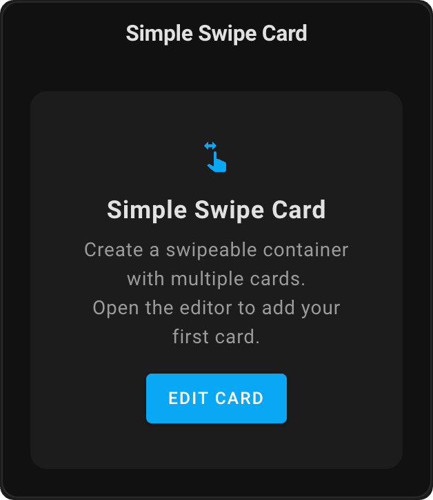
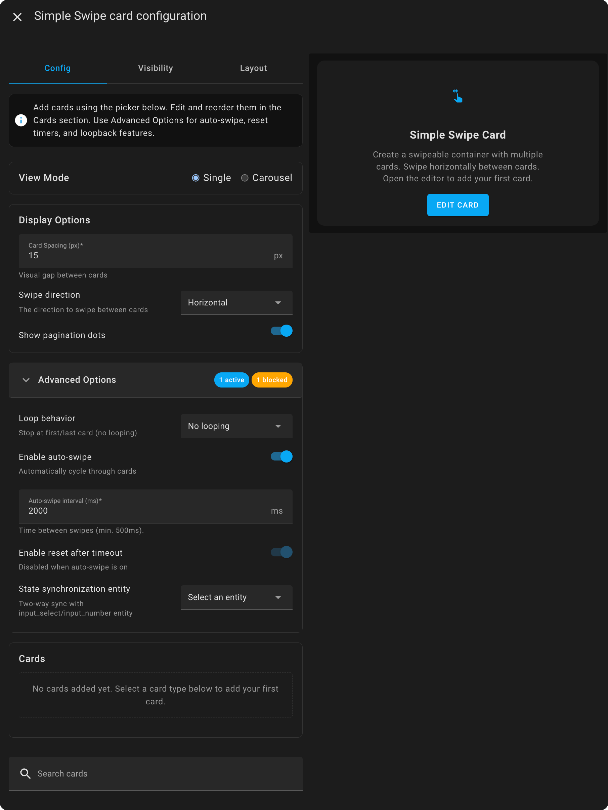

# Simple Swipe Card

A swipeable container card for Home Assistant that allows you to add multiple cards and swipe between them.


## Features
- Swipe between multiple cards
- Pagination dots
- Configurable card spacing
- Visual editor support

## Installation

### HACS (Recommended)
1. Open HACS
2. Go to "Frontend" section
3. Click on the three dots in the top right corner
4. Select "Custom repositories"
5. Add this repository URL
6. Click "Add"
7. Search for "Simple Swipe Card" and install it


### Manual Installation
1. Download `simple-swipe-card.js` from the latest release
2. Copy it to `config/www/simple-swipe-card/simple-swipe-card.js`
3. Add the following to your configuration.yaml:
   ```yaml
   lovelace:
     resources:
       - url: /local/simple-swipe-card/simple-swipe-card.js
         type: module
   ```
4. Restart Home Assistant

## Configuration
This card can be configured using the visual editor or YAML.

### Options
| Name | Type | Default | Description |
|------|------|---------|-------------|
| cards | list | Required | List of cards to display |
| show_pagination | boolean | true | Show/hide pagination dots |
| card_spacing | number | 15 | Space between cards in pixels |

### Example Configuration
```yaml
type: custom:simple-swipe-card
cards:
  - type: weather-forecast
    entity: weather.home
  - type: entities
    entities:
      - sensor.temperature
      - sensor.humidity
show_pagination: true
card_spacing: 15
```

## Visual Editor

The Simple Swipe Card includes a visual editor that appears when you add or edit the card through the Home Assistant UI. Features include:
- Reorder cards for swiping order
- Visual on/off toggle for pagination dots
- Simple number input for card spacing
- Real-time preview of changes
  

#### Search for 'Simple Swipe Card'


#### Edit the card


You can search for cards you want to add to the Simple Swipe Card in the search bar. Click on them to add them to the configuration. 


You can edit the added cards by clicking on the :pencil2: icon. 

## Support
If you find this card useful, please consider:
- Starring the repository
- Sharing with the community
